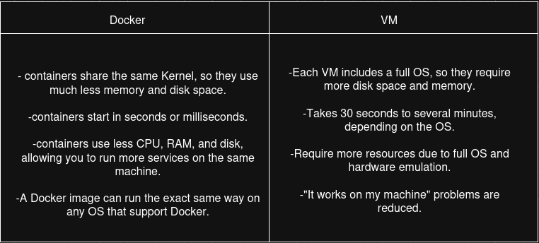
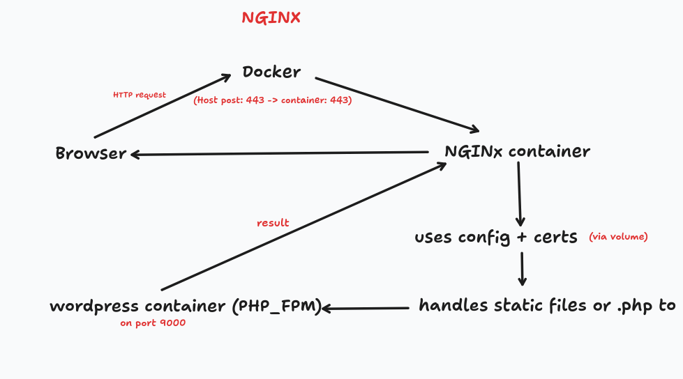

# Inception

Build and configure a mini server infrastructure using Docker and Docker compose inside a virtual machine.

# Inderstanding the basics

## 🐳 Docker
**Docker** is an open platform for developing, shipping and running applications. It provides the ability to run an appication in isolated environment called a **container**, the isolation and security lets you run many containers simultaneously on a given host.

## Docker VS Virtual Machines
Docker and Virtual Machines both help you run applications in isolated environments, but Docker offers several advantages:

## Docker Architecture
Below is a simple diagram showing how the docker **client** and **daemon** interact:

## Dockerfile
**Dockerfile** is a text file that contains a set of instructions to build a **Docker image**
**Think of it like a recipe:** it tells Docker how to create an environment with everything your app or service needs to run.

**Here are the most useful Dockerfile instructions:**

`FROM debian:bullseye`  
This line is usually the first instruction in a Dockerfile.
Here's what it means:
**debian:** is the name of the linux distribution.
**bullseye:** is the code name of a specific version(Debian 11).
Sets the base image for your image : when you create a Docker image, you don't build everything from scratch, you start with an existing base image.

`COPY`  
Copy files or folders from your host machine into the image being built, so the container can use them when it runs.

`RUN apt-get update && apt-get install -y `  
Executes a shell command during the image creation, not when the container starts.

`EXPOSE `  
Documents which port the container listens on.

`CMD [""]`  
Defines the default command and arguments to run when the container starts.
It can be overridden at runtime using `docker run`

`ENTRYPOINT ["bash", "/tools/mariadb.sh"]`  
Sets the main command that will always run, even if the user provides arguments.
It can be combined with `CMD` to provide default arguments.

## Docker Images
**Docker image** is a blue print for creating containers, it contains (code, dependecies, OS environment, scripts, files, ..)
You build an image with: `docker build -t image-name`
You run a container from that image: `docker run image-name`
You can create multiple running containers from the same image.

## Container
**Container** is a running version from a Docker image
`docker ps` list running containers
`docker exec -it container-name bash` Enters a running container's shell

## Docker Volume
**Docker volume** is a special storage location on your host system, it lets your container store data outside its own filesystem, so the data persists even if the container is stopped, deleted, or rebuilt.

## Docker Network
**Docker Network** allows containers to communicate with each other in a secure, isolated and controlled way.
**bridge** think of it as a **virtual LAN (local network) inside your computer. Containers on the same bridge network can communicate with each other using container names as hostnames.  
In **Docker Compose**: `driver: bridge` creates a user-defined bridge network more powewrful than default one.

## Docker Compose
**Docker compose** is a tool that lets you define and run multi-container Docker applications using a simple YAML file.

## How Docker works?
1- You write a **Dockerfile** describing how to build an image.  
2- You bild an **image**  
3- You run that image in a **container**  
=> Managing individual containers/ images.

## How Docker Compose works?
1- You write a docker-compose.yml file that defines:  
                - Each service (like NGINX, WordPress, MariaDB)  
                - Volumes for data.  
                - Networks to connect services.  
                - Ports to expose.  
2- You launch all services by : `docker-compose up`  
=> Managing multi-container applications, connecting them with a private network.

# Nginx Container

## What is Nginx?
**Nginx** is a high performance web server and reverse proxy.it's widely used to:
* Serve static files (HTML, CSS, ...)
* Act as a reverse proxy for backend services (PHP, WordPress, ...)
* Hanle HTTPS(TLS) connections.
* Improve performance and security.

## What is TLS?
**Transport Layer Security** is a security protocol used to encrypt communications between a client and a server.  
TLS is the modern replacement for the old SSL protocol.  
A **TLS Certificate** is a digital file that:  
* Proves your server's identity (so users know they're talking to you).
* Encrypts communication so no one can read or modify the data between client and server.  
To generate them use : `openssl`  

## Dockerfile

Explanation of some instructions:  

* `RUN apt-get update && apt-get install -y nginx openssl` -> update the pachage list and installs nginx (the web server) and openssl (used to create, generate an handle SSL certificates).  
Now your image has both NGINX and OpenSSL installed.  
  
* `COPY conf/dfault.conf /etc/nginx/conf.d/default.conf` -> copy default.conf inside the container where NGINX looks for config files.  

* `RUN chmod 600 /etc/ssl/private/key.pem` -> 600 = read and write for the owner only, this is aggod security practice especially for private keys.  

* `EXPOSE 443` -> documents that the container is expected to listen on port 443, it does not open the port to the outside world.  

* `CMD["nginx", "-g", "daemon off;" ]` -> when container starts, run the nginx server and keep it running in the foreground.  

## ConfigFile

the NGINX configfile sefines hoe to serve a secure **WordPress website** over HTTPS **(port 443)** using PHP-FPM running in a container named wordpress.  

* `listen 443 ssl;` -> tells the nginx to listen for HTTPS traffic on port 443 with TLS enabled.
  
* `ssl_certificate` and `ssl_certificate_key` -> paths to your sel-signed TLS certificate and its private key.  

* `ssl_prefer_server_ciphers on;` -> Ensures the server's cipher(method or algorith to encrypt and decrypt data) choices are preferred over the client's (for better seecurity).  

* `root` -> path where nginx looks for the files to serve when a client requests a URL.  

* `index index.php index.html index.htm;` -> when accessing a folder try to serve index.php first, then index.html, then index.htm.  

* `try_files $uri $uri/ /index.php?$args;` -> tries to serve the exact file at `$uri` if that not a file, try it as a directory `$uri/` if neither a file nor a directory exists, rewrite the request to `index.php`, and pass the original query string.  

* `location ~ \.php$` -> matches any request ending in .php.  

* `include fastcgi_params;` -> loads necessary FastCGI parameters.  

* `fastcgi_pass wordpress:9000;` -> foewards PHP requeststo the container named wordpress, on port 9000(this is usually where php-fpm listens).  

* `fatscgi_index index.php;` -> default file for PHP processing.  

* `fastcgi_param SCRIPT_FILENAME $document_root$fastcgi_script_name;` -> tells FastCGI wich actual PHP file to execute.

## How NGINX works at runtime?

  

# MariaDB Container

## What is MAriaDB?

**MariaDB** is an open-source relational database management system, designed as a drop-in replacement for MYSQL.  
It stores and organizes your data in tables(like WordPress posts, users, comments, etc.).  

## Dockerfile

* `RUN apt-get update && apt-get install -y mariadb-server && rm -rf /var/lib/apt/lists/*` -> updates the package list and installs the MariaDB database server, and removes cache files to reduce image size.  

* `COPY conf/my_custom.cnf /etc/mysql/mariadb.conf.d/my_custom.cnf` -> overriding or extending the default MariaDB configuration by adding your own file.  

* `COPY tools/setup.sh /usr/local/bin/setup.sh` -> adds your custom setup script to the container.  

* `CMD["/usr/local/bin/setup.sh"]` -> this tells Docker: when the container starts, run this script. Your `setup.sh` is now the entrypoint for the container.  

## Configuration file

It controls how the MariaDB server daemon behaves.  

* `[mysqld]` -> is the main configuration section for the MariaDB server.  

* `bind-address = 0.0.0.0` -> tells MAriaDB to listen on all network interfaces to make it accessible from other services in your Docker network, like wordpress.  

* `user = mysql` -> specifies which Linux system user should run the mysqld process.  

* `datadir = /var/lib/mysql` -> tells MariaDB where to store all the database files (tables, indexes, ...)  

* `port = 3306` -> 3306 is the default MySQL/MariaDB port, so WordPress and other apps know how to reach it.  

## Initialization script

This script runs the first time the MariaDB container starts, to initialize database (users and passwords).  

`service mariadb start` -> temporarily satarts MariaDB, so SQL commands can run, this line is needed because you're building MariaDB from scratch in Debian, it's not auto running.  

`sleep 5` -> gives the MariaDB server time to fully start berore you run commands.  

Run sql commands inside MariaDB.  

`mysqladmin -u root -p"${DB_ROOT_PASSWORD}" shutdown` -> shuts down the MariaDB server after initialization is complete, because you will restart it cleanly and properly in the next step, as the main process.  

`exec mysqld_safe` -> replaces the current shell process with mysqld_safe(a safe launcher for the real DB server (mysqld)), that means mysqld_safe becomes PID1, the main process of the container, so if it exits the container stops.  

=> MariaDB now runs as the main process (PID 1):  
- Accepts connections from WordPress.  
- Keeps container alive.  
- Restarts automatically if it crashes.  

# WordPress Container

**WordPress** is a free ope source content management system that allows you to build and manage websites easily, without needing to write code, it's built with PHP and MySQL/MariaDB.  

## Dockerfile

these are essential tools for WordPress to run:  
`php-fpm` : runs PHP code for WordPress.  
`php-mysql` : allows PHP to talk to MariaDB.  
`curl, wget` : download WordPrss from wordpress.org.  
`tar, unzip` : extract compressed files(Wordpress comes as .tar.gz or .zip).  
`mariadb-client` : lets the container connect to your MAriaDB server to test/setup.  
`apt-get clean` : cleans up cache to reduce final image size.  

`ENTRYPOINT ["/tmp/setup.sh"]` : when this container runs, the docker start by executing /tmp/setup.sh.

## WordPress script

`curl -O https://raw.githubusercontent.com/wp-cli/builds/gh-pages/phar/wp-cli.phar`
`chmod +x wp-cli.phar`  
`mv wp-cli.phar /usr/local/bin/wp`  
-> this block installs WP-CLI the WordPress Command Line Interface.  
`mkdir -p /run/php`  
`cd /var/www/wordpress`  
-> prepare runtime environment.  
`if [ ! -f wp-config.php ]; then`  
`curl -O https://wordpress.org/latest.tar.gz`  
`tar -xzf latest.tar.gz --strip-components=1`  
`rm latest.tar.gz`  
-> download and configure WordPress if not already set up.  
`sed -i "s/database_name_here/${DB_NAME}/" wp-config.php`  
-> replaces placeholders with real values from environment variables, so now wp-config.php knows how to connect to your MariaDB container.  
`sleep 10`
-> waits 10 seconds to make sure the MariaDB server is fully ready to accept connections.  
`wp core install`  
->install WordPress with WP-CLI.  
`sed -i 's|listen = /run/php/php7.4-fpm.sock|listen = 9000|' /etc/php/7.4/fpm/pool.d/www.conf`  
-> configure PHP-FPM.  
`exec php-fpm7.4 -F`
-> start PHP-FPM in foreground, so it becomes PID1, this is required to keep the docker container running.  
=> WordPress now runs via PHP-FPM.