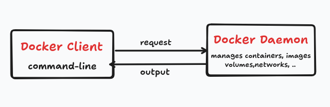

# Inception

Build and configure a mini server infrastructure using Docker and Docker compose inside a virtual machine.

# Inderstanding the basics

## 🐳 Docker
**Docker** is an open platform for developing, shipping and running applications. It provides the ability to run an appication in isolated environment called a **container**, the isolation and security lets you run many containers simultaneously on a given host.

## Docker VS Virtual Machines
Docker and Virtual Machines both help you run applications in isolated environments, but Docker offers several advantages:

## Docker Architecture
Below is a simple diagram showing how the docker **client** and **daemon** interact:

## Dockerfile
**Dockerfile** is a text file that contains a set of instructions to build a **Docker image**
**Think of it like a recipe:** it tells Docker how to create an environment with everything your app or service needs to run.

**Here are the most useful Dockerfile instructions:**

`FROM debian:bullseye`  
This line is usually the first instruction in a Dockerfile.
Here's what it means:
**debian:** is the name of the linux distribution.
**bullseye:** is the code name of a specific version(Debian 11).
Sets the base image for your image : when you create a Docker image, you don't build everything from scratch, you start with an existing base image.

`COPY ./conf/default.conf /etc/nginx/conf.d/`  
Copy files or folders from your host machine into the image being built, so the container can use them when it runs.

`RUN apt-get update && apt-get install -y nginx`  
Executes a shell command during the image creation, not when the container starts.

`EXPOSE 443`  
Documents which port the container listens on (in this example : 443)

`CMD ["nginx", "-g", "daemon off;"]`  
Defines the default command and arguments to run when the container starts.
It can be overridden at runtime using `docker run`

`ENTRYPOINT ["bash", "/tools/mariadb.sh"]`  
Sets the main command that will always run, even if the user provides arguments.
It can be combined with `CMD` to provide default arguments.

## Docker Images
**Docker image** is a blue print for creating containers, it contains (code, dependecies, OS environment, scripts, files, ..)
You build an image with: `docker build -t image-name`
You run a container from that image: `docker run image-name`
You can create multiple running containers from the same image.

## Container
**Container** is a running version from a Docker image
`docker ps` list running containers
`docker exec -it container-name bash` Enters a running container's shell

## Docker Volume
**Docker volume** is a special storage location on your host system, it lets your container store data outside its own filesystem, so the data persists even if the container is stopped, deleted, or rebuilt.

## Docker Network
**Docker Network** allows containers to communicate with each other in a secure, isolated and controlled way.
**bridge** think of it as a **virtual LAN (local network) inside your computer. Containers on the same bridge network can communicate with each other using container names as hostnames.  
In **Docker Compose**: `driver: bridge` creates a user-defined bridge network more powewrful than default one.

## Docker Compose
**Docker compose** is a tool that lets you define and run multi-container Docker applications using a simple YAML file.

## How Docker works?
1- You write a **Dockerfile** describing how to build an image.  
2- You bild an **image**  
3- You run that image in a **container**  
=> Managing individual containers/ images.

## How Docker Compose works?
1- You write a docker-compose.yml file that defines:  
                - Each service (like NGINX, WordPress, MariaDB)  
                - Volumes for data.  
                - Networks to connect services.  
                - Ports to expose.  
2- You launch all services by : `docker-compose up`  
=> Managing multi-container applications, connecting them with a private network.

# Nginx Container

## What is Nginx?
**Nginx** is a high performance web server and reverse proxy.it's widely used to:
* Serve static files (HTML, CSS, ...)
* Act as a reverse proxy for backend services (PHP, WordPress, ...)
* Hanle HTTPS(TLS) connections.
* Improve performance and security.

## What is TLS?
**Transport Layer Security** is a security protocol used to encrypt communications between a client and a server.  
TLS is the modern replacement for the old SSL protocol.  
A **TLS Certificate** is a digital file that:  
* Proves your server's identity (so users know they're talking to you).
* Encrypts communication so no one can read or modify the data between client and server.  
To generate them use : `openssl`  

## ConfigFile

the NGINX configfile sefines hoe to serve a secure **WordPress website** over HTTPS **(port 443)** using PHP-FPM running in a container named wordpress.  
* `listen 443 ssl;` -> tells the nginx to listen for HTTPS traffic on port 443 with TLS enabled.
* `ssl_certificate` and `ssl_certificate_key` -> paths to your sel-signed TLS certificate and its private key.  
* `ssl_prefer_server_ciphers on;` -> Ensures the server's cipher(method or algorith to encrypt and decrypt data) choices are preferred over the client's (for better seecurity).  
* `root` -> path where nginx looks for the files to serve when a client requests a URL.  
* `index index.php index.html index.htm;` -> when accessing a folder try to serve index.php first, then index.html, then index.htm.  
* `try_files $uri $uri/ /index.php?$args;` -> tries to serve the exact file at `$uri` if that not a file, try it as a directory `$uri/` if neither a file nor a directory exists, rewrite the request to `index.php`, and pass the original query string.  
* `location ~ \.php$` -> matches any request ending in .php.  
* `include fastcgi_params;` -> loads necessary FastCGI parameters.  
* `fastcgi_pass wordpress:9000;` -> foewards PHP requeststo the container named wordpress, on port 9000(this is usually where php-fpm listens).  
* `fatscgi_index index.php;` -> default file for PHP processing.  
* `fastcgi_param SCRIPT_FILENAME $document_root$fastcgi_script_name;` -> tells FastCGI wich actual PHP file to execute.